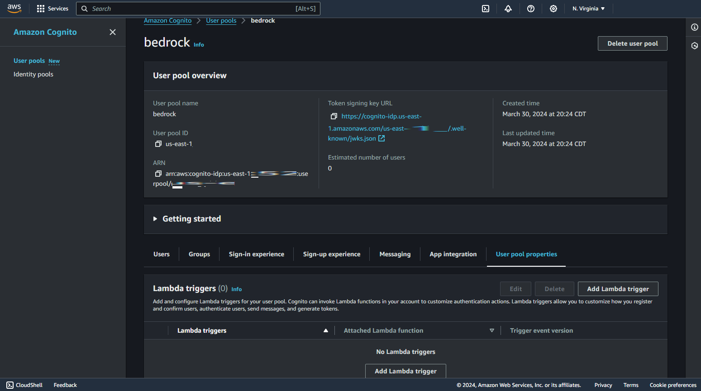

# AWS Cognito for Bedrock Storyteller Flask Application running on Containerized AWS Lambda with Web Adapter

This is a sample application that demonstrates how to use AWS Cognito to add login functionality to a Bedrock Storyteller Flask application running on AWS Lambda with Web Adapter. The main purpose of this tutorial is to exhibit how to use AWS Cognito to authenticate users and authorize them to access the application.

Adding logging in and logging out functionality to your application makes it more secure. AWS Cognito is a great service that provides authentication, authorization, and user management for your applications. It is easy to use and provides a lot of features out of the box.

Throughout this tutorial, you will learn how to:

- Create a new AWS Cognito User Pool
- Add a new user to the User Pool
- Confirm the user using pre-signup Lambda trigger
- Update the Bedrock Storyteller Flask application to use AWS Cognito for authentication
- Deploy the application to a containerized AWS Lambda with Web Adapter
- Use AWS SAM to deploy the application

The ultimate goal is to learn how to use AWS Cognito to authenticate users and authorize them to access the application. By the end of this tutorial, you will have a Bedrock Storyteller Flask application running on AWS Lambda with Web Adapter that uses AWS Cognito for authentication and authorization as shown on the below gif.


## Prerequisites

Before you begin, ensure you have the following:

- AWS CLI installed and configured
- Docker installed
- Python installed
- AWS SAM CLI installed
- Clone the [Bedrock Storyteller Flask application](https://github.com/OmarCloud20/CDKTF-Tutorial.git) repository.

## Step 1: Create a new AWS Cognito User Pool

1. Open the AWS Management Console and navigate to the AWS Cognito service.
2. Click on `Create user pool`.
3. Check the `Email` and then click on `Next`.
4. Leave the `Password policy` as default and select `No MFA`.
5. Uncheck the `Enable self-service account recovery` and then click on `Next`.


6. Check the `Enable self-registration`, select `Don't automatically send messages`, leave the rest as default, and then click on `Next`.
7. Select `Send email with Cognito` and then click on `Next`.


8. Enter a name for the user pool and `App client name` and select `Generate a client secret`.


9. Under `Advanced app client settings`, make sure you select `(ALLOW_REFRESH_TOKEN_AUTH), (ALLOW_ADMIN_USER_PASSWORD_AUTH), (ALLOW_USER_PASSWORD_AUTH)` and then click on `Next`.

10. Finally, review the `Review and create` page and then click on `Create user pool`.

**Note:**

Capture the following information as you will need it later:

- User Pool ID
- App client ID
- App client secret (navigate to `App integration` -> `App clients and analytics` -> click on `App client name` -> `Show client secret`)


---

## Step 2: Add a new user to the User Pool

### Creating a Lambda function to confirm new users

1. Navigate to the AWS Lambda service.
2. Click on `Create function`.
3. Enter a name for the function, select `Python 3.12` as the runtime, and then click on `Create function`.
4. Copy the code from the `lambda_function.py` file in the `assets` directory and paste it into the Lambda function code editor. Then click on `Deploy`.


### Adding the Lambda trigger to the User Pool

1. Navigate back to the AWS Cognito service.
2. Click on the newly created user pool.
3. Select `User pool properties` and click on `Add Lambda trigger`.
4. Select `Sign-up` as a Trigger type and `Pre sign-up trigger` as a lambda trigger type. 
5. Under `Lambda function`, assign the lambda function that you created earlier and then click on `Add Lambda trigger`.




**Note:**

The purpose of having a pre-signup Lambda trigger is to confirm the user before adding them to the user pool. Usually, the users confirm their email address by clicking on the link sent to their email address. In this tutorial, we are confirming the user automatically using the Lambda trigger because we are not sending any email to the users and we are limiting access to the application to only the users that we add manually. Moreover, we can use dummy email addresses for the users.

### Adding a new user to the User Pool

We will add a new user to the user pool using the AWS CLI and the Lambda trigger will confirm the user automatically.

1. Compute a secret stash value for the user's password using the following command:

```bash
echo -n "[username][app client ID]" | openssl dgst -sha256 -hmac [app client secret] -binary | openssl enc -base64
```
Actual example:

```bash
echo -n "omar@omar.com4njih1dqgurs5r529l0mgl4j21" | openssl dgst -sha256 -hmac r6v7qk0ui0aunhkc4jk8eh1pb4g8nl4715fg4l0aejfithdmg5r -binary | openssl enc -base64
```


- Replace `[username]` with the email of the user you want to add.
- Replace `[app client ID]` with the app client ID of the user pool.
- Replace `[app client secret]` with the app client secret of the user pool.
- Save the output of the command as the secret stash value.

**Note:**

- To learn more about how to compute the secret stash value, refer to the [AWS documentation](https://docs.aws.amazon.com/cognito/latest/developerguide/signing-up-users-in-your-app.html#cognito-user-pools-computing-secret-hash).


- My username is `omar@omar.com`.
- My app client ID is `4njih1dqgurs5r529l0mgl4j21`.
- My app client secret is `r6v7qk0ui0aunhkc4jk8eh1pb4g8nl4715fg4l0aejfithdmg5r`.

2. Add the user to the user pool using the following command:

```bash
aws cognito-idp sign-up \
--client-id 'APP_CLIENT_ID' \
--secret-hash `SECRET_HASH` \
--username 'USERNAME' \
--password 'PASSWORD' \
--user-attributes Name=email,Value=`USERNAME` \
--region 'REGION' \
--profile 'PROFILE'
```

Actual example:

```bash
aws cognito-idp sign-up \
--client-id 4njih1dqgurs5r529l0mgl4j21 \
--secret-hash o1364n3vGN3BBLJNJCb858KjGDMdx+Jyt85KIFVJwXc= \
--username omar@omar.com \
--password Test_Pass123 \
--user-attributes Name=email,Value=omar@omar.com \
--region us-east-1 \
--profile default
```

**Note:**

- Replace `[PROFILE]` with the name of your AWS profile, if it's not the default profile.
- Once you run the command, you could navigate to the AWS Cognito service and check the `Users` tab to see the newly added user. Also, if you navigate to the Monitor section of the Lambda function, you will see that the Lambda function was triggered and the user was confirmed.


---

## Step 3: Update the Bedrock Storyteller Flask application to use AWS Cognito for authentication

1. Open the Bedrock Storyteller Flask application in your favorite code editor.
2. Update the values of the following variables in the `cognito_config.py` file in the `app` directory:

```python
COGNITO_REGION = 'us-east-1'
COGNITO_USER_POOL_ID = 'us-east-1_Q0l9hNEw1'
COGNITO_CLIENT_ID = '2p87n43ntcdv8f4ml5jh3cd8ji'
COGNITO_CLIENT_SECRET = 'vivq45062h98669dgv3rthnhppi6da0virnrlapn02b7cs4r54l'
```

3. Notice in line 16 of the `app.py` file in the `app` directory that we are using the `app.secret_key`. This is used to sign the session cookie. You can generate a secret key using the following command:

```bash
python -c 'import secrets; print(secrets.token_hex())'
```

**Note:**

- Refer to the [Flask documentation](https://flask.palletsprojects.com/en/2.2.x/config/#SECRET_KEY) to learn how to compute the secret key value.

---

## Step 4: Deploy the application to a containerized AWS Lambda with Web Adapter using AWS SAM

1. Using your terminal, navigate to the root directory of the Bedrock Storyteller Flask application.

### The directory structure

```bash
├── README.md
├── assets
├── imgs
├── app
│   ├── Dockerfile
│   ├── __init__.py
│   ├── app.py
│   ├── cognito_config.py
│   ├── requirements.txt
│   ├── static
│   └── templates
│       ├── about.html
│       ├── index.html
│       └── login.html
└── template.yaml
```

2. Build the Docker image using the following command:

```bash
sam build --use-container --profile `NAME_OF_YOUR_AWS_PROFILE`
```

**Note:**

- Replace `[NAME_OF_YOUR_AWS_PROFILE]` with the name of your AWS profile, if it's not the default profile.

3. Deploy the application using the following command:

```bash
sam deploy --guided --profile `NAME_OF_YOUR_AWS_PROFILE`
```

**Note:**

- Follow the prompts to deploy the application:

```bash
Stack Name [sam-app]: Bedrock Storyteller
AWS Region [us-east-1]: us-east-1
Confirm changes before deploy [y/N]: y
Allow SAM CLI IAM role creation [Y/n]: y
Disable rollback on stack creation failures [y/N]: n
FlaskFunction Function URL has no authentication. Is this okay? [y/N]: y
Save arguments to configuration file [Y/n]: y
SAM configuration file [samconfig.toml]: `click enter`
SAM configuration environment [default]: `click enter`
```

4. Once the deployment is complete, you will see the output with the `FlaskFunction` URL. Copy the URL and open it in your browser.

---

## Conclusion

In this tutorial, you learned how to use AWS Cognito to authenticate users and authorize them to access a Bedrock Storyteller Flask application running on AWS Lambda with Web Adapter. You created a new AWS Cognito User Pool, added a new user to the User Pool, confirmed the user using a pre-signup Lambda trigger, updated the Bedrock Storyteller Flask application to use AWS Cognito for authentication, and deployed the application to a containerized AWS Lambda with Web Adapter using AWS SAM.

The next step is to explore adding AWS Cognito sign-in and sign-out functionality to the application. I hope you have enjoyed this tutorial and found it helpful. Feel free to reach out if you have any questions or feedback.

---

## Future Work

[ ] enhance data chunking of the Bedrock Storyteller Flask application.